# CLion IDE üzerinde Gömülü Sistem Geliştirme (CLion, STM32CubeMX, Debugger(OpenOCD, GDB, ))

Bu repo JetBrains CLion IDE üzerinde STM32CubeMX çerçevesinde gömülü sistem 
projeleri geliştirmek için kılavuz niteliğindedir.


## Gerekli Yazılımlar
- [Jetbrains CLion IDE](https://www.jetbrains.com/) (Test edilen CLion 2021.1.1 Build #CL-211.7142.21)
- [STM32CubeMX](https://www.st.com/en/development-tools/stm32cubemx.html?sc=stm32cubemx) (Test edilen Version 6.2.1)
- [MinGW64](http://mingw-w64.org/) (Test edilen Version MinGW-W64-builds-4.3.5)
- [OpenOCD](http://openocd.org/) (Test edilen xPack OpenOCD v0.11.0-1)
- [GNU Arm Embedded Toolchain](https://developer.arm.com/tools-and-software/open-source-software/developer-tools/gnu-toolchain/gnu-rm/downloads) (Test edilen 10-2020-q4-major)


## Proje oluşturma

Yeni STM32CubeMX projesi oluşturarak başlayalım. Dosya konumuna ve proje ismine (benimki embed-test) dikkat edin.

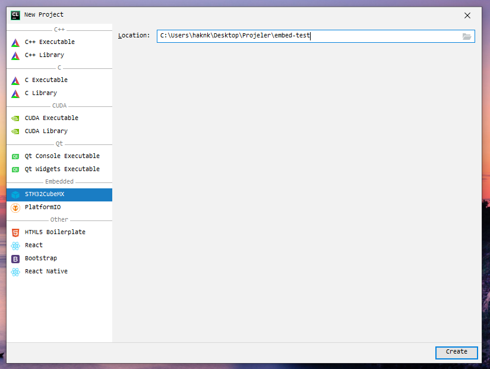

Settings > Build, Execution and Deployment > Toolchains ayarlarını yüklediğiniz yazılımların pathlerine göre düzenlenmelidir.
Bazı yazılımların pathları Windows işletim sistemi için Ortam Değişkenleri içinde Path olarak eklenmesi gerekecektir.

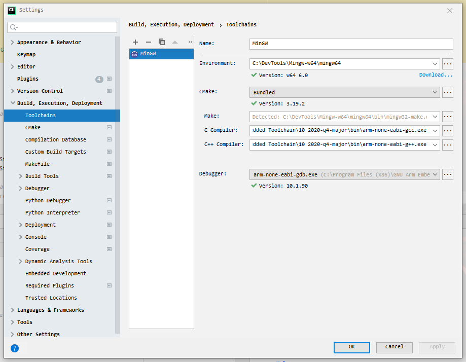

Edit Configurations için

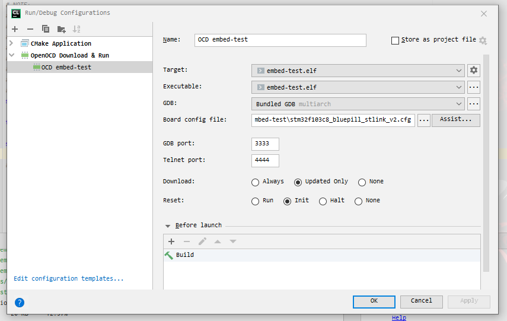

## STM32CubeMX ile Kodların Üretilmesi

Projeyi açtıktan sonra ``embed-test.ioc`` adında proje dosyası görmelisiniz. 
Bu doğruda STM32CubeMX ile açılabilir haldedir. 
CLion üzerinden dosyayı görüntülemek istediğinizde default olarak STM32F030F4Px mikrokontrolcüsü
için ayarlandığı yazsa da henüz bir şey ayarlanmamıştır.

"Open with STM32CubeMX" yazısına tıklayarak proje yaratılması gerekir.

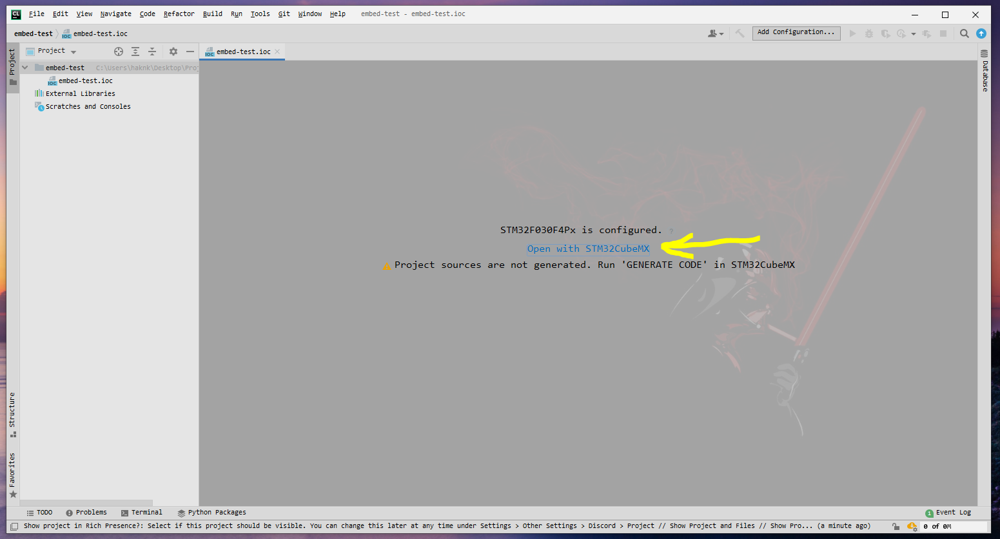

Açılan STM32CubeMX penceresinde STM32F030Px için seçilmiş boş proje olduğunu görebilirsiniz. 1. numaralı sarı renk ile gösterilen "STM32F030Px" yazısına tıklayarak yeni mikrokontrolcü seçimi yapılabilir.
Ben elimde hazır olarak bulunan STM32F103C8 (BluePill) mikrokontrolcüsünü seçeceğim. 


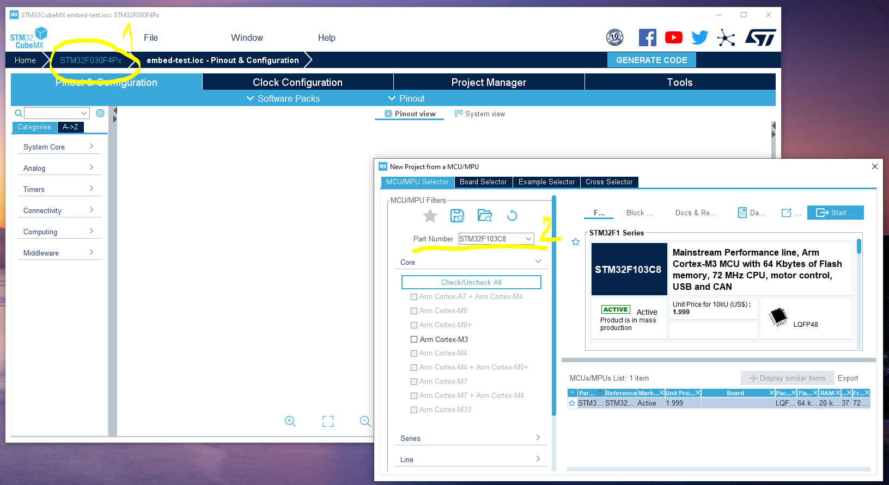

### Proje için konfigürasyonlar

LED yakıp söndürme için çok basit proje ayarları ile devam edeceğim.

- Öncelikle System Core >```SYS``` > Debug: ``Serial Wire`` olarak ayarlanmalı.

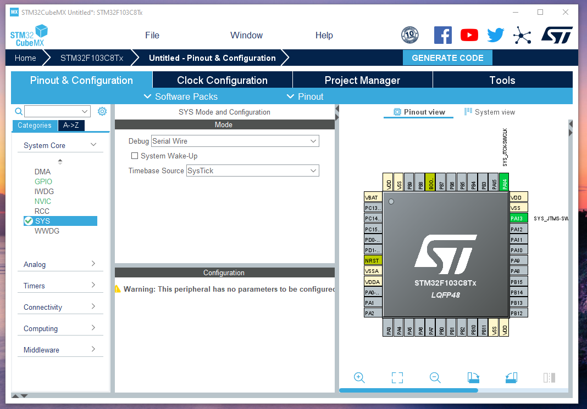

- Devam eden basamakta **System Core** > **RCC** için **High Speed Clock (HSE) :** ``Crystal/Ceramic Resonator`` olarak değiştirilmeli.

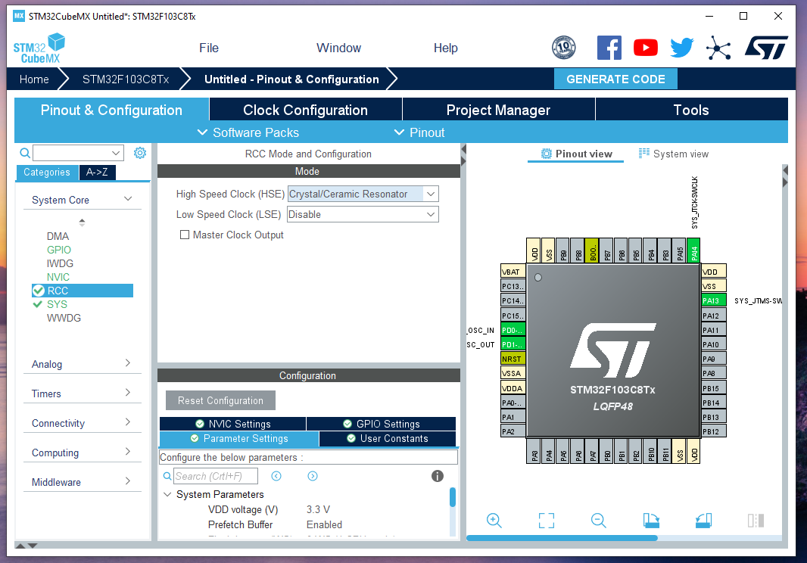

- Fizik bir tepki görebilmek için de **GPIOC** portuna bağlı **GPIO13** numaralı pini **OUTPUT** olarak seçiyorum.

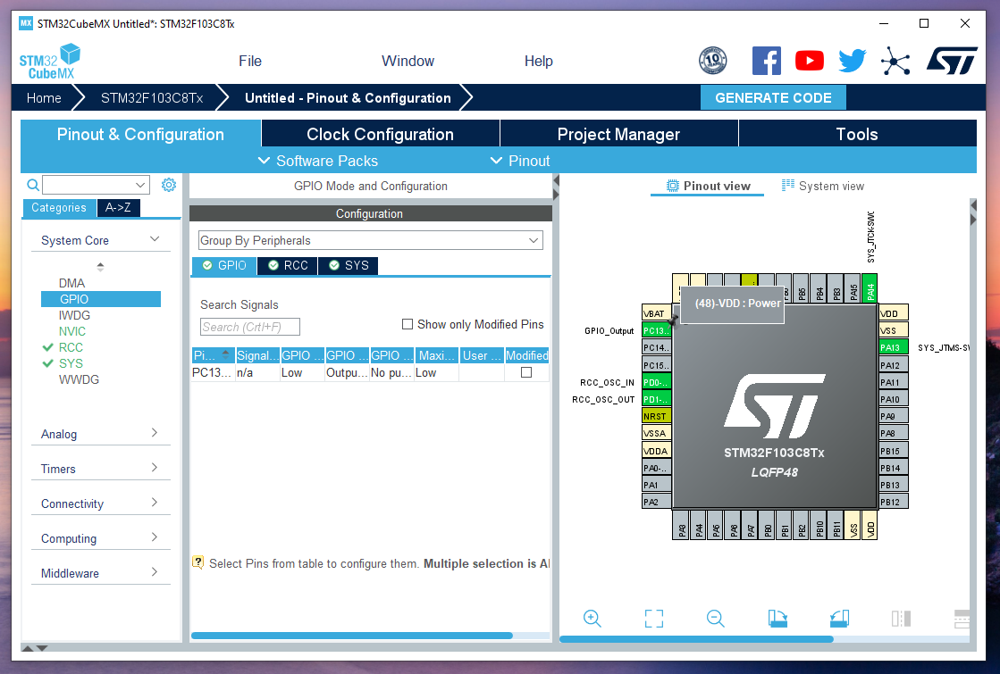

### Kodun Üretilmesi (GENERATE CODE)

Project Name bölümünü CLion projesi ismi ile aynı girdi olarak ayarlanmalıdır.
Yine benzer şekilde Project Location girdisi de CLion projesini göstermelidir.

Burada önemli olan Toolchain/IDE kısmını ```SW4STM32``` olarak belirtilmesidir. "**Generate Under Root**" seçeneneği de seçili olmalıdır.
Şimdi "**GENERATE CODE**" butonu tıklayarak kodlar üretilebilir.

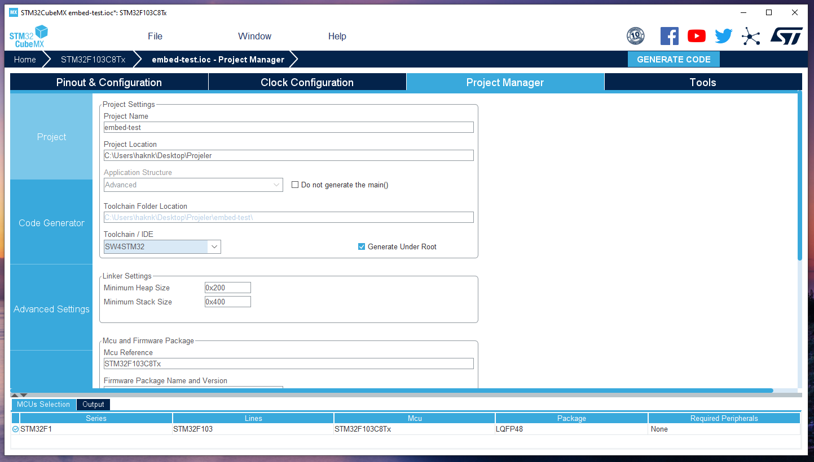

CLion penceresine geri döndüğünüzde sizden Board Config Files seçimi penceresi karşılamalıdır. 
Donanımıza uygun şekilde config dosyasını seçtikten sonra "**Copy to Project & Use**" butonuna tıklayarak ayarlayın.
Kopyalarak ayarlamamızın sebebi içinde düzenlemeler yapılması gerekebilir. Orjinal config dosyasına zarar vermemek için 
bu seçenek kullanılmalıdır.

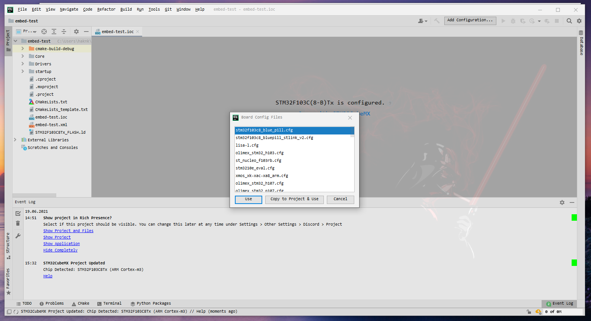

### Derleme , Yükleme ve Debug (Build, Upload & Debug)

Eğer benim gibi ST-LINK-v2 üzerinden STM32 mikrokontrolcüsü programlıyor iseniz *.cfg formatlı config dosyanız hatalı olacaktır.

OpenOCD'nin stm32f10c8_blue_pill.cfg dosyası içeriği;
````c
# STM32F103C8 "Blue Pill"

# NOTE:
# There is a fair bit of confusion about whether the "Blue Pill" has 128kB or 64kB flash size.
# The most likely cause is that there exist a -C8 and a -CB variant of the STM32F103, where
# the C8 has 64kB, the CB has 128kB as per specification. "Blue Pill" boards are manufactured
# by a lot of different vendors, some may actually use the CB variant but from a cursory look
# it very hard to tell them apart ("C8" and "CB" look very similar). Nevertheless, people have
# tried using the full 128kB of flash on the C8 and found it to be working. Hence this board file
# overrides the internal size detection. Be aware though that you may be using you particular
# board outside of its specification. If in doubt, comment the following line.
set FLASH_SIZE 0x20000

source [find target/stm32f1x.cfg]
````
 ST-LINK üzerinden interface tanımlası yapılarak şu şekilde dosya ile upload sorunu çözülebilir;
````c
# STM32F103C8 "Blue Pill"

# NOTE:
# There is a fair bit of confusion about whether the "Blue Pill" has 128kB or 64kB flash size.
# The most likely cause is that there exist a -C8 and a -CB variant of the STM32F103, where
# the C8 has 64kB, the CB has 128kB as per specification. "Blue Pill" boards are manufactured
# by a lot of different vendors, some may actually use the CB variant but from a cursory look
# it very hard to tell them apart ("C8" and "CB" look very similar). Nevertheless, people have
# tried using the full 128kB of flash on the C8 and found it to be working. Hence this board file
# overrides the internal size detection. Be aware though that you may be using you particular
# board outside of its specification. If in doubt, comment the following line.
source [find interface/stlink-v2.cfg]

transport select hla_swd

source [find target/stm32f1x.cfg]

# Flash the blink program

````
main.c içerisine basit bir led yakıp söndürme kodu ekledim;

````c++

  /* Infinite loop */
  /* USER CODE BEGIN WHILE */
  while (1)
  {
    /* USER CODE END WHILE */

    /* USER CODE BEGIN 3 */
      HAL_GPIO_TogglePin(GPIOC, GPIO_PIN_13);
      HAL_Delay(200);
  }
  /* USER CODE END 3 */


````

Build tuşuna basarak derleme ile ilgili sorun olup olmadığını kontrol edebilirsiniz. Tüm ayarlar doğru ise sorunsuz bir
şekilde "Build finished" yazısı görmelisiniz. Herhangi bir sorunuz olursa "**Issue**" bölümünde sorunlarınızı paylaşabilirsiniz.

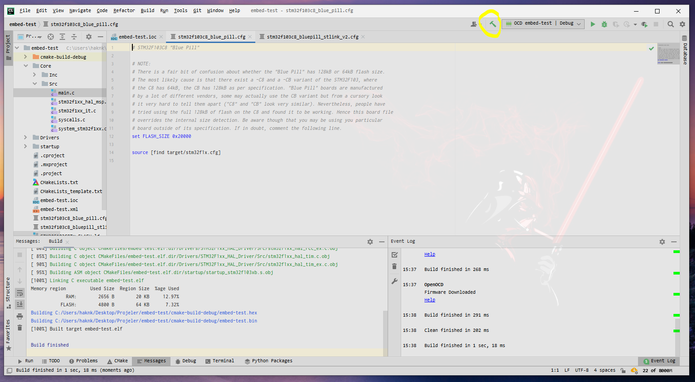

Run tuşu işe yükleme yapılabilir. Eğer gerçek bir devreniz benim ki ile aynı ise LED'in yanıp söneceğini görmelisiniz.

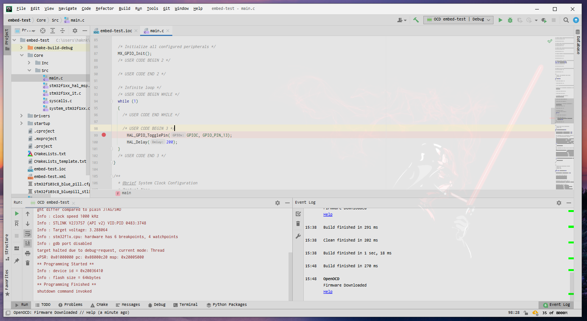

Debug için breakpoint belirledikten sonra Debug tuşuna basarak yapabilirsiniz.

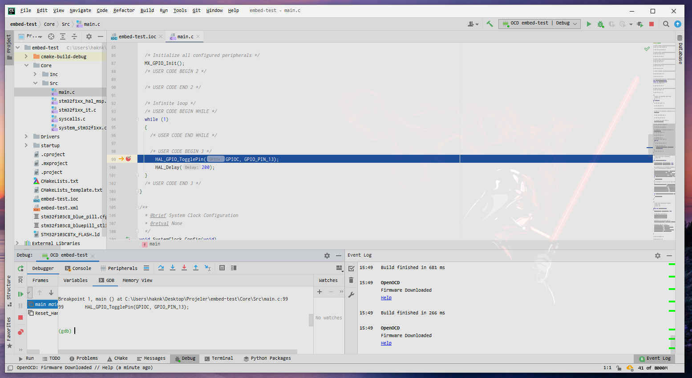

#### Peripherals

Peripherals üzerinden Register'ları görüntülemek isterseniz her donanım için önceden hazırlanmış .svd formatlı dosyaya 
ihtiyacınız vardır. İnternet üzerinde arama yaparak bulabilirsiniz.

STM32F103C8 için [buraya](STM32F103.svd) ekliyorum.

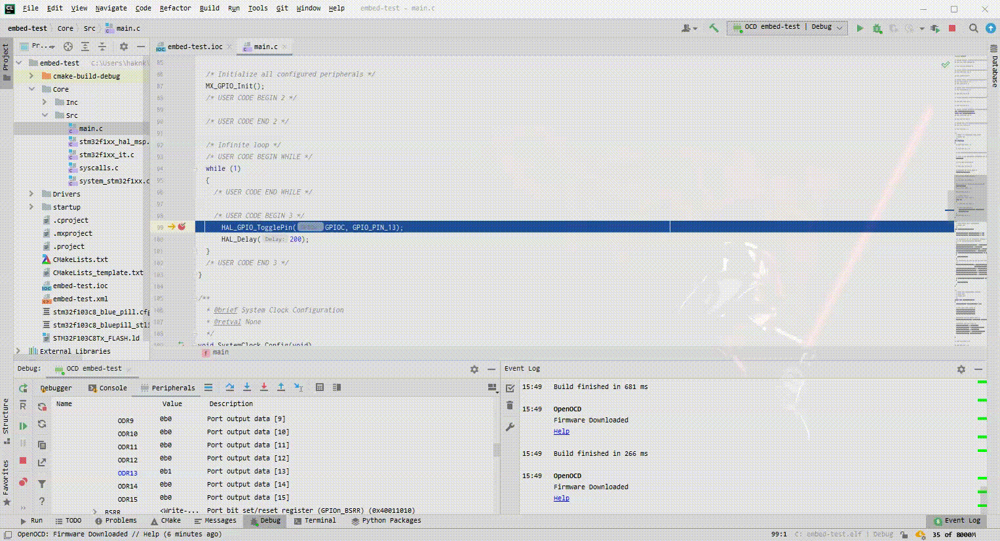