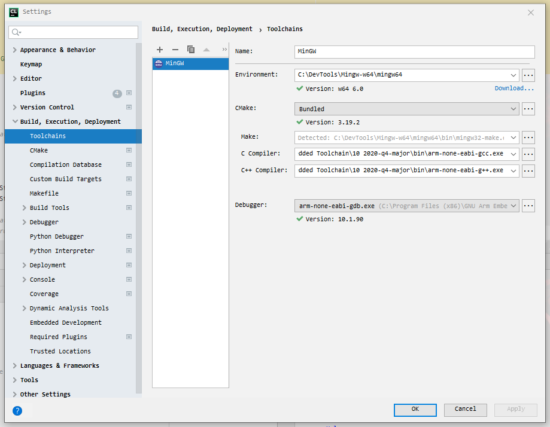
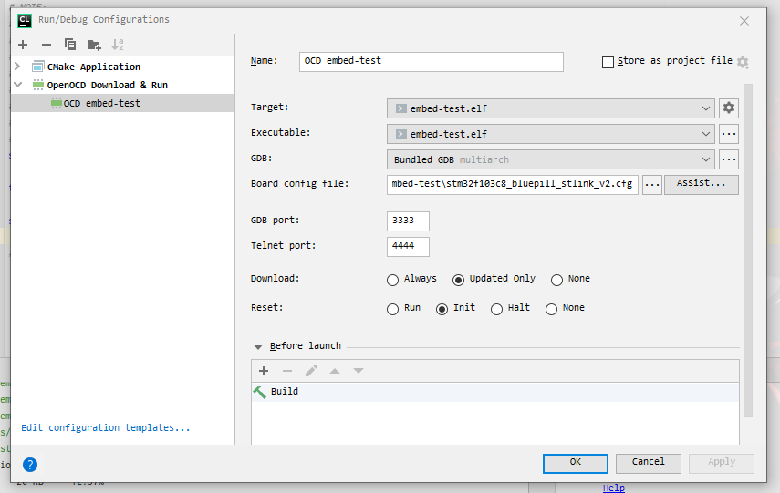
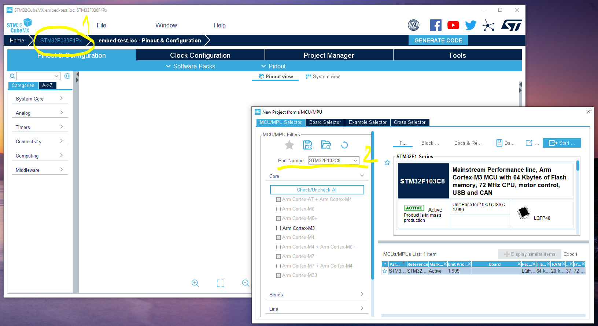
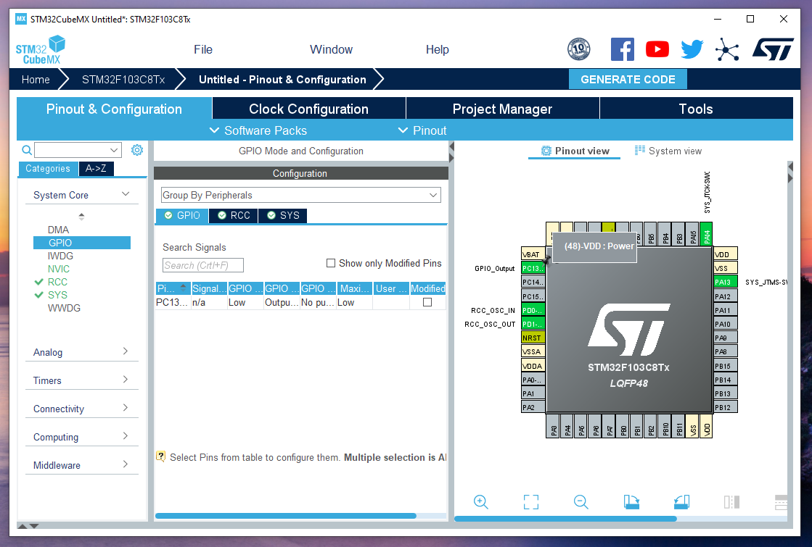
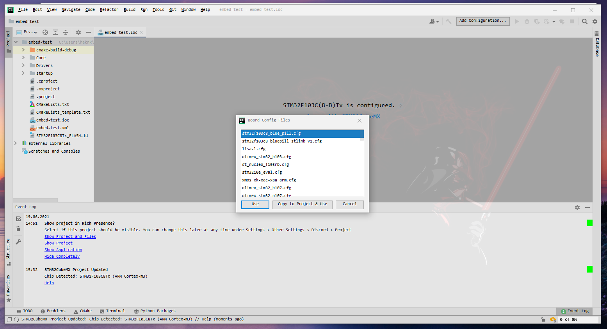
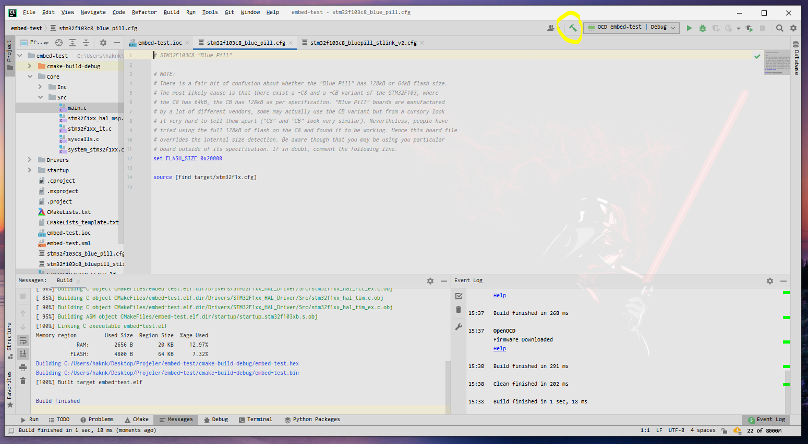
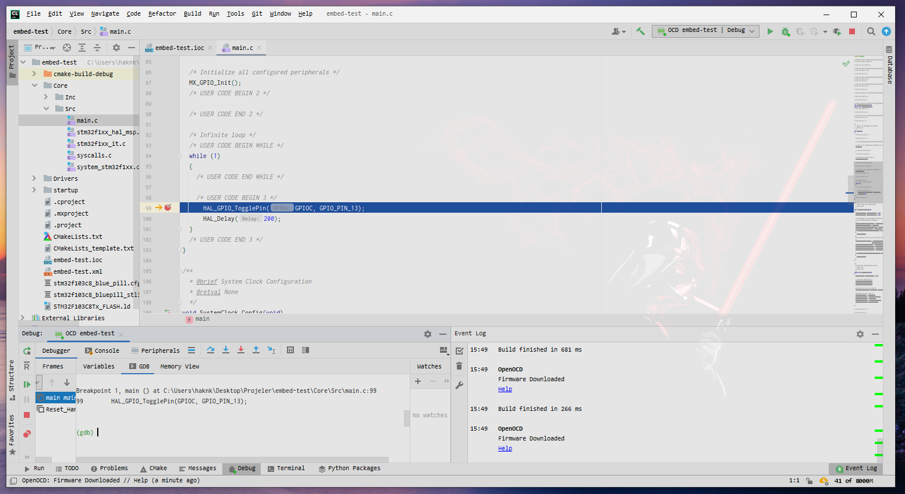

For [Turkish](README-tr.md)

**If you found it useful, you can provide support by "Star" this repo.**

# Embedded System Development on CLion IDE (CLion, STM32CubeMX, Debugger(OpenOCD, GDB ), STLINK-v2)

This repo is embedded in the STM32CubeMX framework on the JetBrains CLion IDE
The system is a guide for developing projects.

## Required Softwares
- [Jetbrains CLion IDE](https://www.jetbrains.com/) (Tested with CLion 2021.1.1 Build #CL-211.7142.21)
- [STM32CubeMX](https://www.st.com/en/development-tools/stm32cubemx.html?sc=stm32cubemx) (Tested with Version 6.2.1)
- [MinGW64](http://mingw-w64.org/) (Tested with Version MinGW-W64-builds-4.3.5)
- [OpenOCD](http://openocd.org/) (Tested with xPack OpenOCD v0.11.0-1)
- [GNU Arm Embedded Toolchain](https://developer.arm.com/tools-and-software/open-source-software/developer-tools/gnu-toolchain/gnu-rm/downloads) (Tested with 10-2020-q4-major)


## Create a New Project

Let's start by creating a new STM32CubeMX project in CLion IDE. Note the file location and the project name (my project "embed-test").


Settings > Build, Execution and Deployment > Toolchains settings should be arranged according to the paths of the software you installed.
Some software's paths will need to be added as Path in Environment Variables for Windows operating system.



For Edit Configurations;



## Generating Codes with STM32CubeMX

After opening the project, you should see a project file named ``embed-test.ioc``.
It can be opened directly with the STM32CubeMX.
When you want to view the file via CLion, it says that it is set for STM32F030F4Px microcontroller by default, but nothing has been set yet.

The project should be created by clicking "Open with STM32CubeMX".


In the STM32CubeMX window that opens, you can see that there is an empty project selected for the STM32F030Px. A new microcontroller can be selected by clicking on the "STM32F030Px" text shown in yellow with number 1.
I will choose the STM32F103C8 (BluePill) microcontroller that I have ready.




### Configurations for the project

I will continue with very simple project settings for LED blinking.

- First of all, it should be set to System Core >```SYS``` > Debug: ``Serial Wire``.


- In the following step, **High Speed ​​Clock (HSE) :** for **System Core** > **RCC** should be changed to ``Crystal/Ceramic Resonator``.


- In order to see a physical response, I choose the pin **GPIO13** connected to the **GPIOC** port as **OUTPUT**.



### Generate Code

The Project Name section should be set as the same entry as the CLion project name.
Similarly, the Project Location entry should point to the CLion project.

The important thing here is to specify the Toolchain/IDE part as ``SW4STM32``. The "**Generate Under Root**" option must also be selected.
Now codes can be generated by clicking the "**GENERATE CODE**" button.


When you come back to the CLion window, you should see the Board Config Files selection window.
After selecting the config file according to your hardware, click the "**Copy to Project & Use**" button to set it.
Adjustments may need to be made within the reason we set it by copying. This option should be used to avoid damaging the original config file.



### Compiling , Upload ve Debugger (Build, Upload & Debug)

If you are programming an STM32 microcontroller via ST-LINK-v2 like me, your *.cfg formatted config file will be incorrect.

Contents of OpenOCD's stm32f10c8_blue_pill.cfg file;
````c
# STM32F103C8 "Blue Pill"

# NOTE:
# There is a fair bit of confusion about whether the "Blue Pill" has 128kB or 64kB flash size.
# The most likely cause is that there exist a -C8 and a -CB variant of the STM32F103, where
# the C8 has 64kB, the CB has 128kB as per specification. "Blue Pill" boards are manufactured
# by a lot of different vendors, some may actually use the CB variant but from a cursory look
# it very hard to tell them apart ("C8" and "CB" look very similar). Nevertheless, people have
# tried using the full 128kB of flash on the C8 and found it to be working. Hence this board file
# overrides the internal size detection. Be aware though that you may be using you particular
# board outside of its specification. If in doubt, comment the following line.
set FLASH_SIZE 0x20000

source [find target/stm32f1x.cfg]
````

By defining the interface over ST-LINK, the file upload problem can be solved as follows;

````c
# STM32F103C8 "Blue Pill"

# NOTE:
# There is a fair bit of confusion about whether the "Blue Pill" has 128kB or 64kB flash size.
# The most likely cause is that there exist a -C8 and a -CB variant of the STM32F103, where
# the C8 has 64kB, the CB has 128kB as per specification. "Blue Pill" boards are manufactured
# by a lot of different vendors, some may actually use the CB variant but from a cursory look
# it very hard to tell them apart ("C8" and "CB" look very similar). Nevertheless, people have
# tried using the full 128kB of flash on the C8 and found it to be working. Hence this board file
# overrides the internal size detection. Be aware though that you may be using you particular
# board outside of its specification. If in doubt, comment the following line.
source [find interface/stlink-v2.cfg]

transport select hla_swd

source [find target/stm32f1x.cfg]

# Flash the blink program

````

I added a simple led flashing code in ```main.c```;

````c++

  /* Infinite loop */
  /* USER CODE BEGIN WHILE */
  while (1)
  {
    /* USER CODE END WHILE */

    /* USER CODE BEGIN 3 */
      HAL_GPIO_TogglePin(GPIOC, GPIO_PIN_13);
      HAL_Delay(200);
  }
  /* USER CODE END 3 */


````

You can check if there is a problem with the build by pressing the Build button. If all settings are correct,
You should see the text "Build finished". If you have any questions, you can share your problems in the "**Issue**" section.



Run button can be loaded to work. If you have a real circuit the same as mine you should see the LED blink.


After you set the breakpoint for Debug, you can do it by pressing the Debug button.



#### Peripherals

If you want to view Registers via Peripherals, you need a pre-prepared .svd format file for each hardware. 
You can find it by searching the internet.

I am attaching [here](STM32F103.svd) for STM32F103C8.

